# Diagrams

Visual documentation of pydantic-deep architecture and workflows using Mermaid syntax.

## System Context Diagram

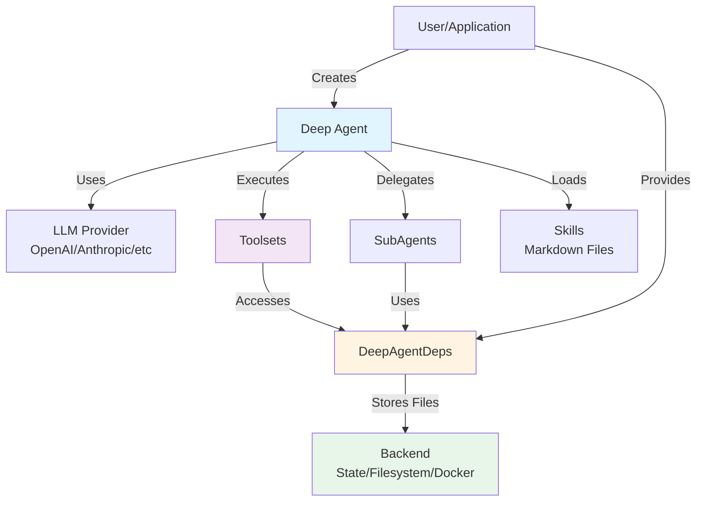

## Component Diagram

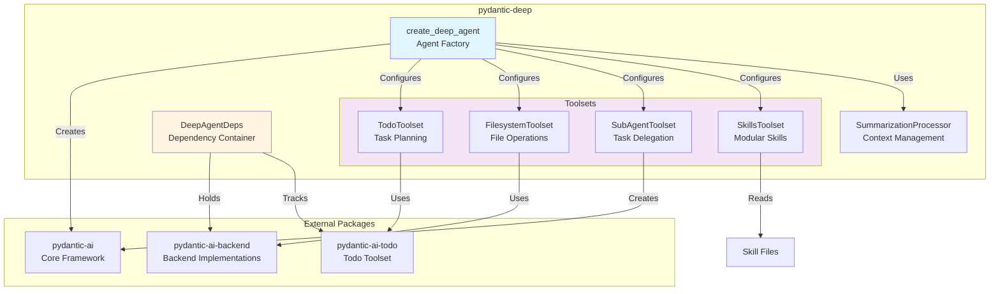

## Agent Execution Sequence

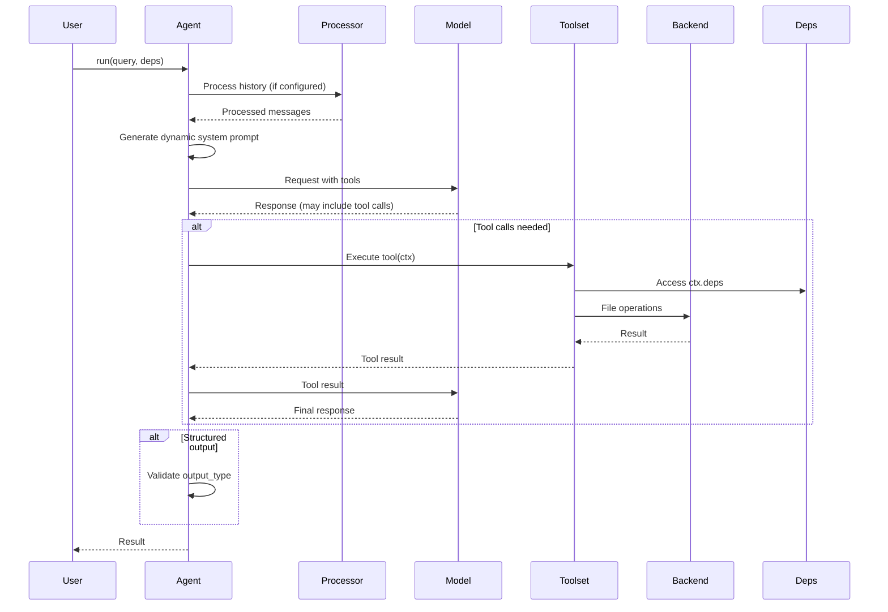

## File Upload Sequence

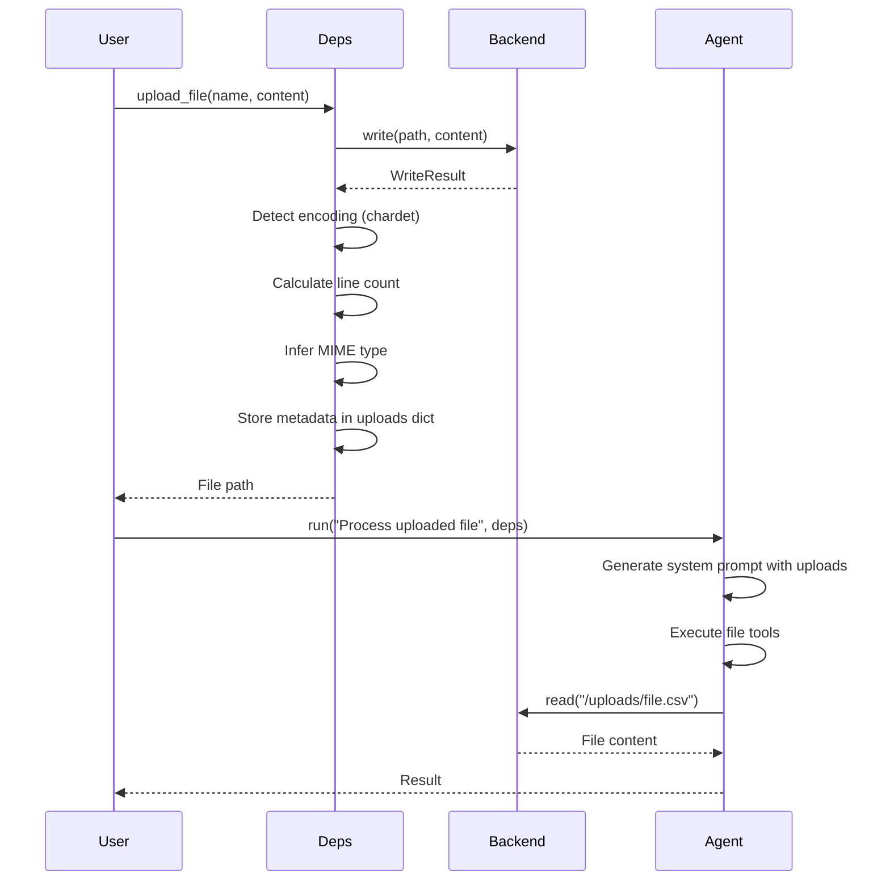

## SubAgent Delegation Sequence

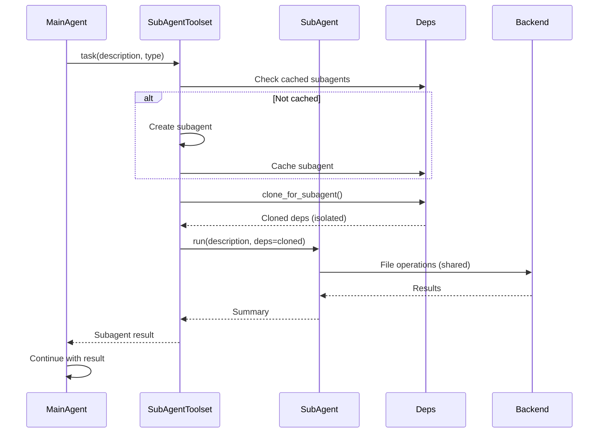

## Summarization Flow

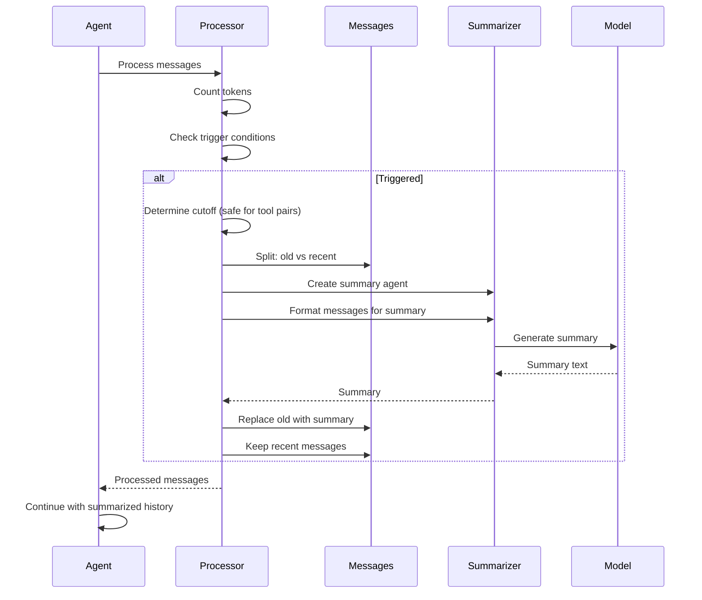

## Human-in-the-Loop Approval Flow

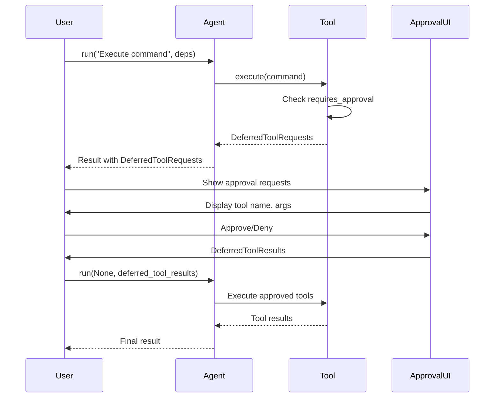

## Skills Loading Sequence

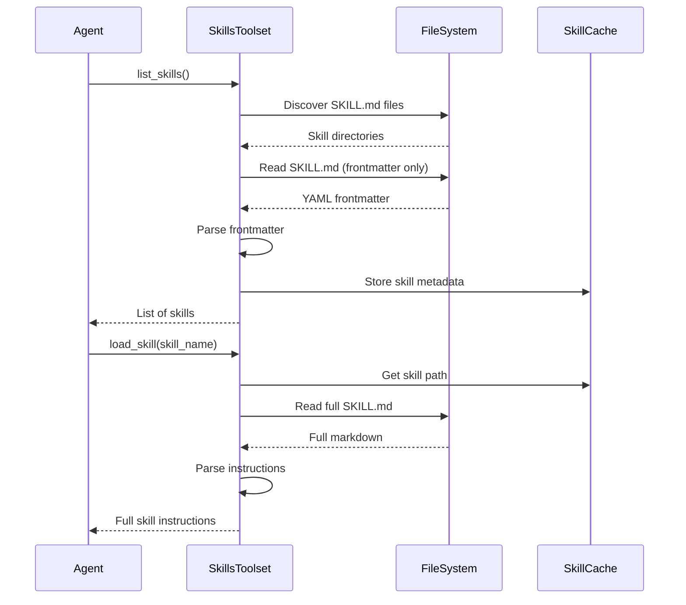

## Multi-User Session Architecture

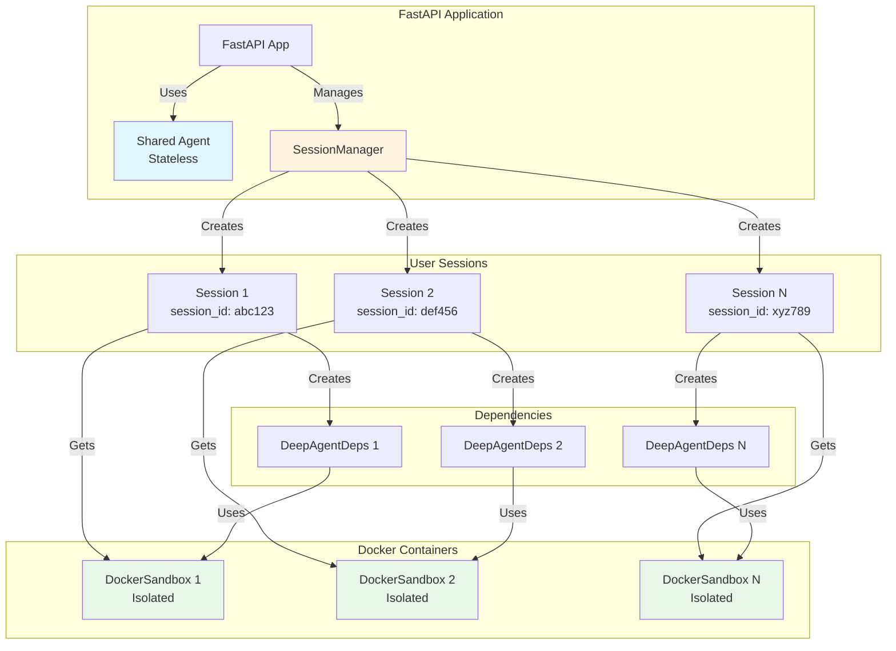

## Data Flow: Agent State

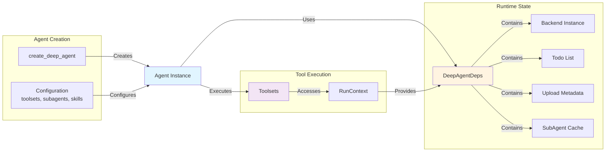

## Toolset Registration Flow

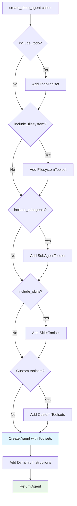
