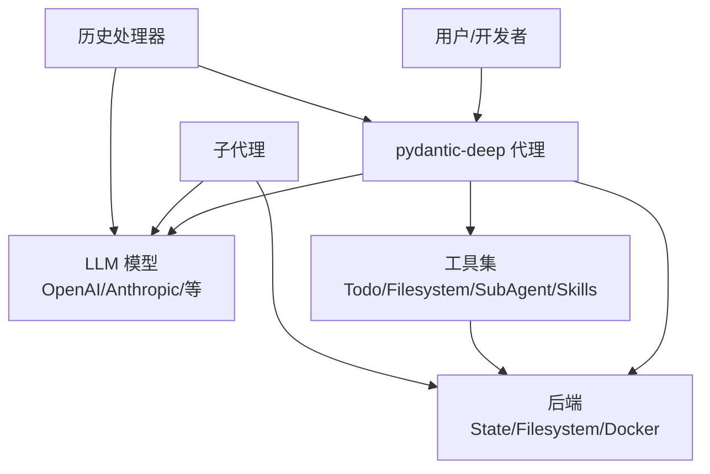
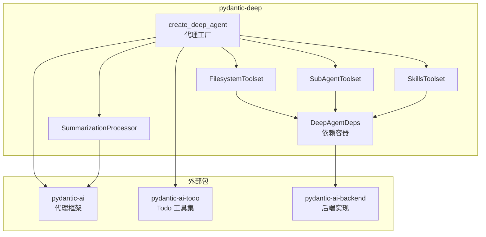
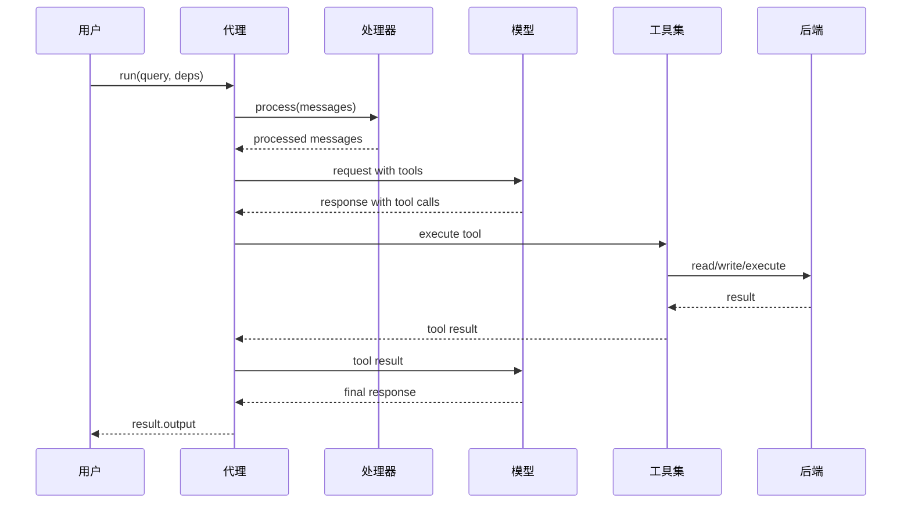
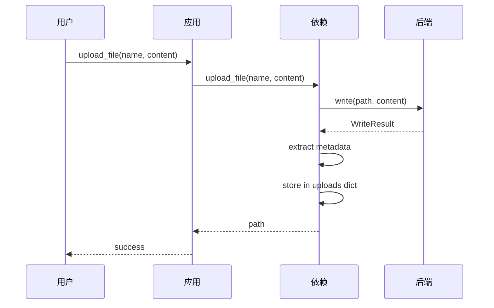
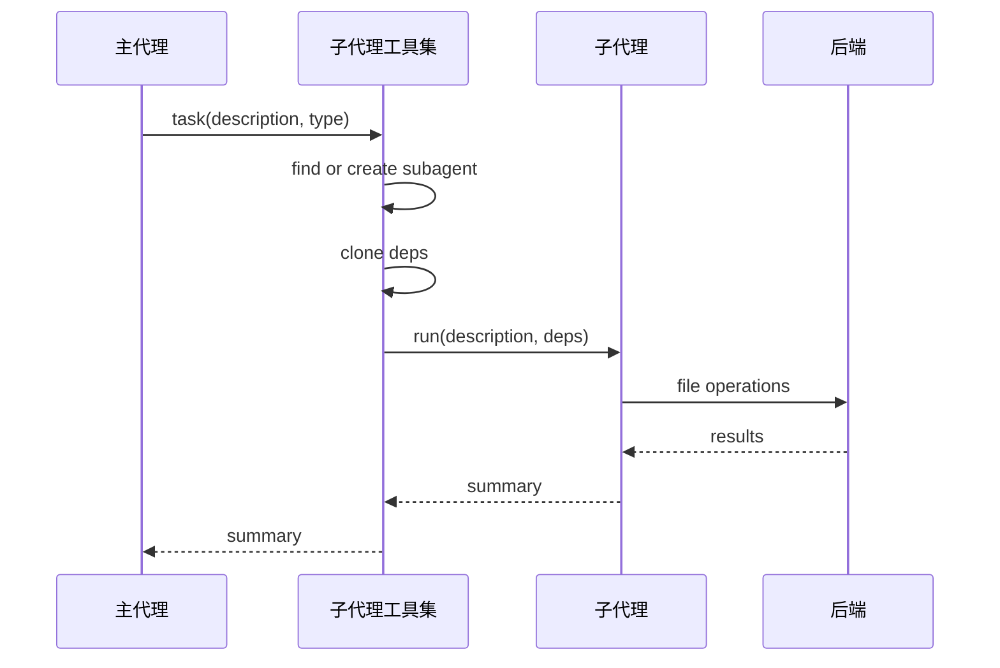
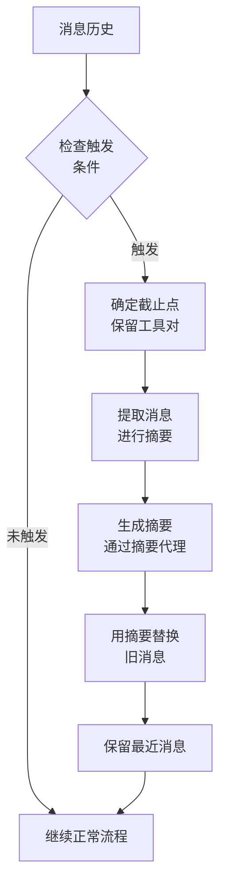
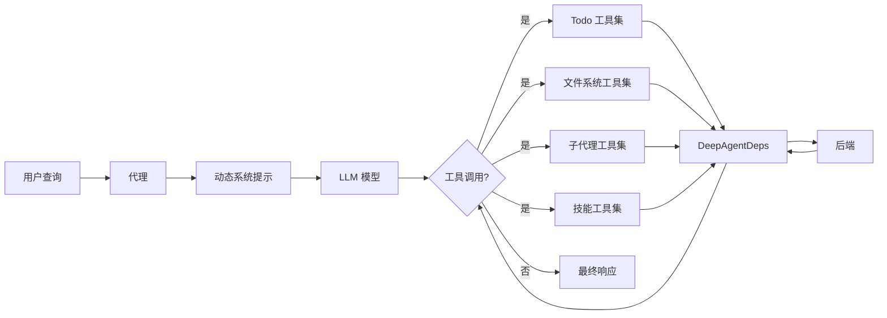
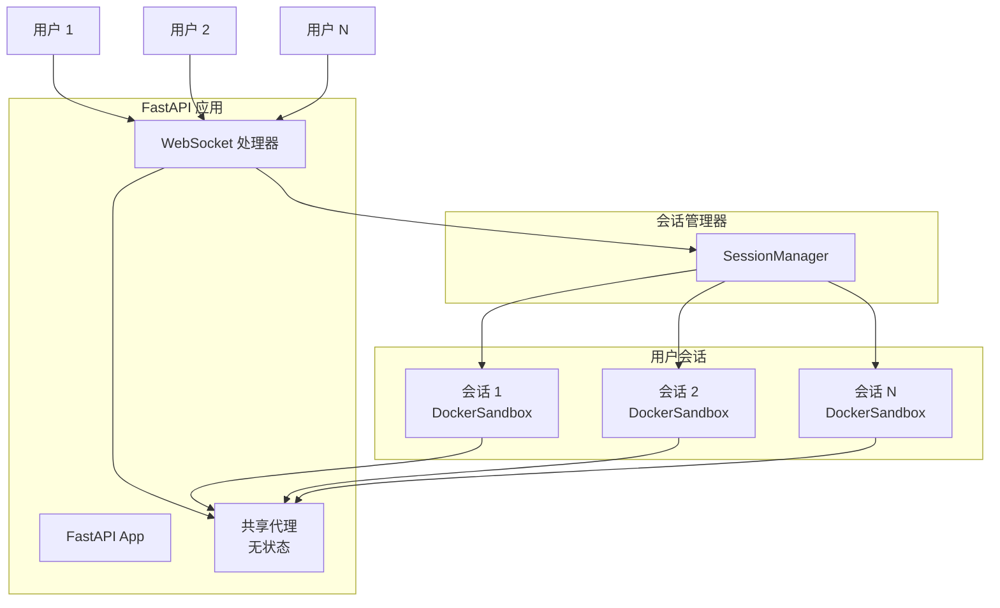
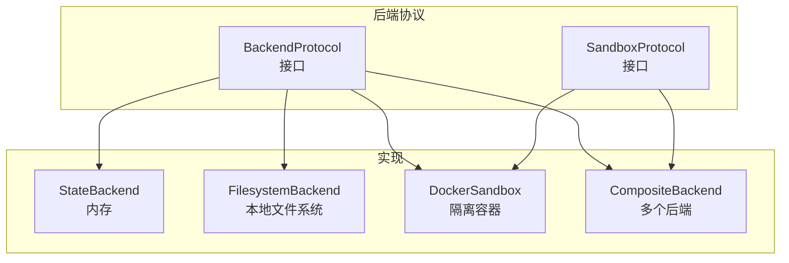

# 图表

使用 Mermaid 语法的可视化系统文档。

## 系统上下文图



## 组件图



## 代理执行序列



## 文件上传序列



## 子代理委托序列



## 摘要流程



## 数据流：带工具集的代理



## 多用户应用拓扑



## 工具集注册

```mermaid
graph LR
    Factory[create_deep_agent] --> Config{配置标志}
    Config -->|include_todo=True| Todo[TodoToolset]
    Config -->|include_filesystem=True| FS[FilesystemToolset]
    Config -->|include_subagents=True| Sub[SubAgentToolset]
    Config -->|include_skills=True| Skill[SkillsToolset]
    Config -->|toolsets=[]| Custom[自定义工具集]
    Todo --> Agent[代理实例]
    FS --> Agent
    Sub --> Agent
    Skill --> Agent
    Custom --> Agent
```

## 后端抽象


