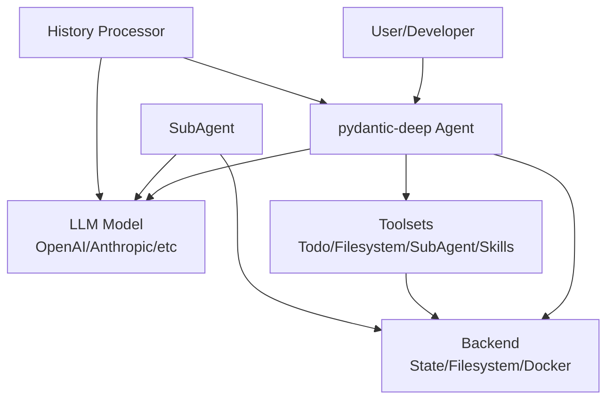
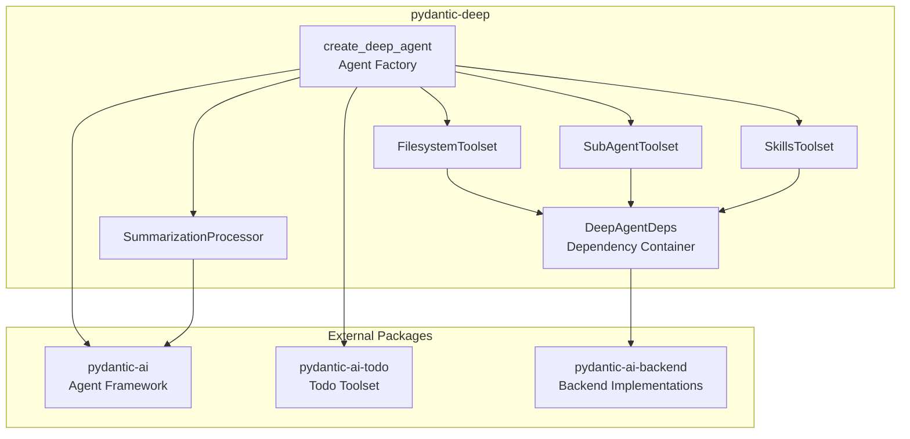
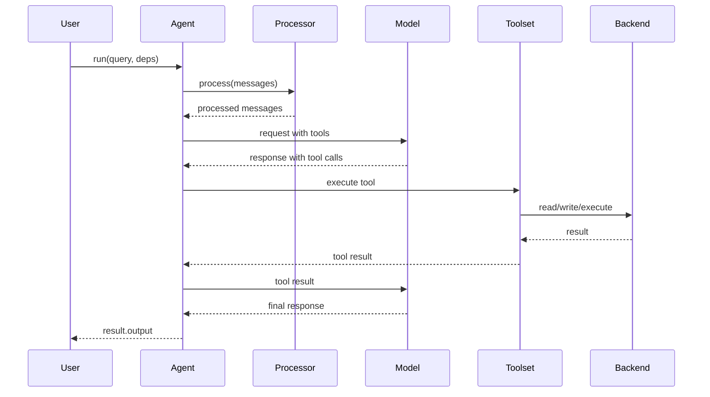
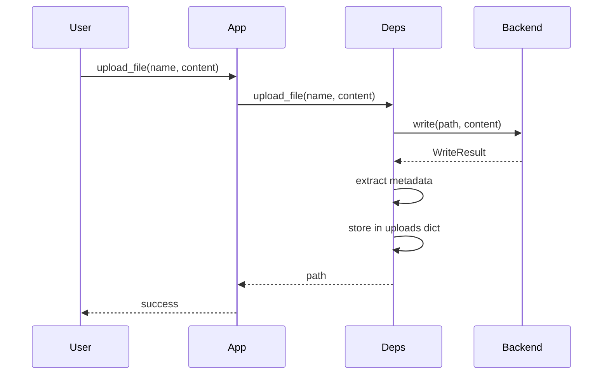
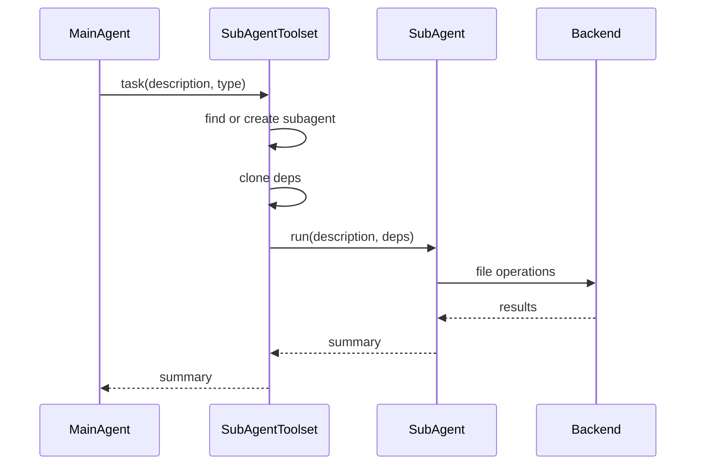
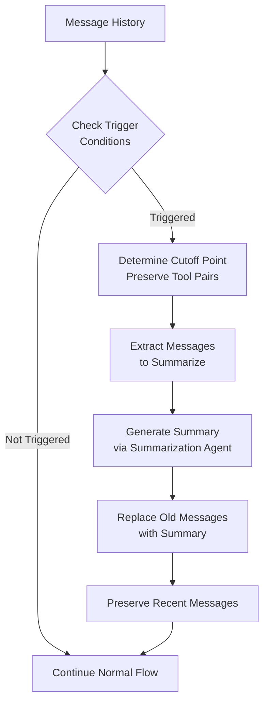
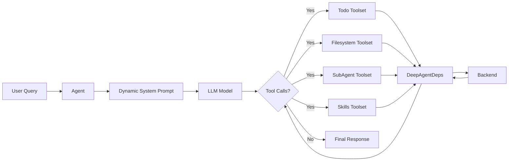
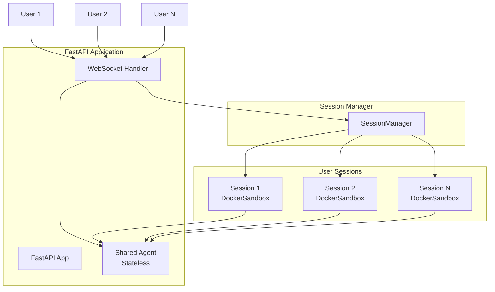
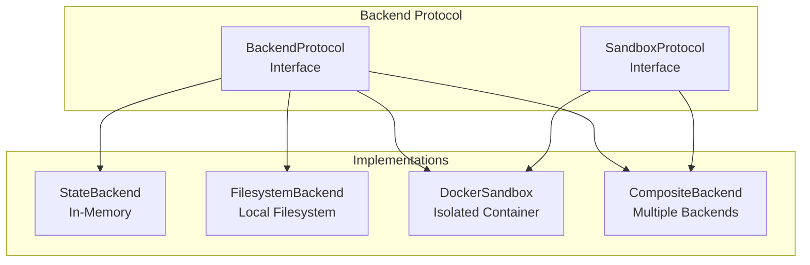

# Diagrams

Visual system documentation using Mermaid syntax.

## System Context Diagram



## Component Diagram



## Agent Execution Sequence



## File Upload Sequence



## SubAgent Delegation Sequence



## Summarization Flow



## Data Flow: Agent with Toolsets



## Multi-User Application Topology



## Toolset Registration

```mermaid
graph LR
    Factory[create_deep_agent] --> Config{Configuration Flags}
    Config -->|include_todo=True| Todo[TodoToolset]
    Config -->|include_filesystem=True| FS[FilesystemToolset]
    Config -->|include_subagents=True| Sub[SubAgentToolset]
    Config -->|include_skills=True| Skill[SkillsToolset]
    Config -->|toolsets=[]| Custom[Custom Toolsets]
    Todo --> Agent[Agent Instance]
    FS --> Agent
    Sub --> Agent
    Skill --> Agent
    Custom --> Agent
```

## Backend Abstraction


